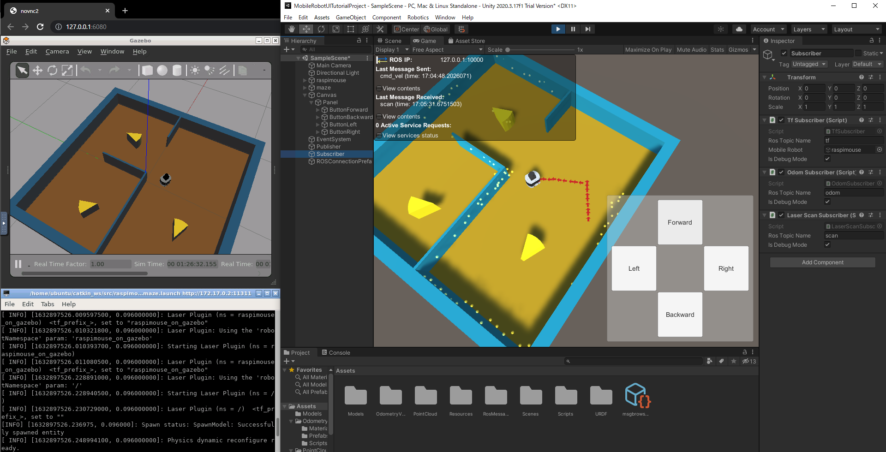

# UnityとROSで学ぶ移動ロボット入門 UI作成編


本教材は Unity と ROS を組み合わせたロボット開発のための入門用教材です。

## 1. はじめるための準備

本教材は、[Git](https://git-scm.com/) を使用してお手元の環境に複製してお使い下さい。

* Gitを使うのが初めての方は、「Git Windows 使い方」 などのキーワードでネット検索すると多くの情報が得られますので参考にしてみて下さい。

Gitがインストールできたら、Git Bash、コマンドプロンプト または Power Shell などから以下のコマンド順番に実行して行きます。

### 1-1. GitHub からファイルを一式を取得する

GitHub からファイルを一式を複製(clone)します。
```
git clone https://github.com/unity3d-jp/Unity-ROS-MobileRobot-UI-Tutorial.git
```

### 1-2. 作業フォルダに移動する
```
cd Unity-ROS-MobileRobot-UI-Tutorial
```

### 1-3. ROS-TCP-Endpoint を取り込む

以下のコマンドを使って、`ROS-TCP-Endpoint` を取り込みます。
```
git submodule update --init --recursive
```
* `ROS-TCP-Endpoint` の説明は後ほど出てきます。

以上で、必要なファイル一式が `Unity-ROS-MobileRobot-UI-Tutorial` フォルダの中に格納されました。

## 2. 次のステップへ

次は [docs/intro0.md](docs/intro0.md) にお進み下さい。

## 3. ライセンスについて

Copyright 2021 Unity Technologies Japan K.K.

本教材は [Apache License 2.0](./LICENSE-2.0) です。(以下の3<sup>rd</sup>パーティ製ソフトウェアを除く)

3<sup>rd</sup>パーティ製ソフトウェアについては [OSSライセンスに基づく表記](./THIRD-PARTY-LICENSE.md) を参照して下さい。