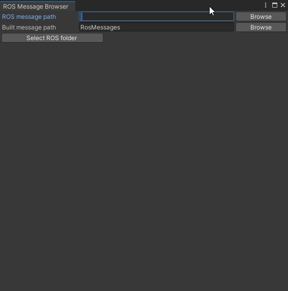

# 付録

## 概要

STEP1～7では扱わなかった内容についても紹介します。

## 動作確認済環境

* Windows 10 Home バージョン 21H2
* Unity 2021.3.4f1
* [Unity-Technologies/ROS-TCP-Connector](https://github.com/Unity-Technologies/ROS-TCP-Connector) v0.7.0
* Docker Desktop 4.9.1

## 独自のROSメッセージへの対応

[Unity-Technologies/ROS-TCP-Connector](https://github.com/Unity-Technologies/ROS-TCP-Connector)では扱うすべてのROSのメッセージファイルをC#にて定義する必要があります。
[`com.unity.robotics.ros-tcp-connector/Runtime/Messages`](https://github.com/Unity-Technologies/ROS-TCP-Connector/tree/v0.7.0/com.unity.robotics.ros-tcp-connector/Runtime/Messages)から予めUnity用に用意されているROSのメッセージ形式を確認できます。  
使うROSのメッセージがROS-TCP-Connectorに予め含まれていない場合にのみ、C#のスクリプトを用意する必要があります。

### 1. ROSのメッセージファイルを用意

変換したいROSのメッセージファイルを用意します。  
例えばRaspberry Pi Mouse実機に搭載されているLEDの点灯・消灯状態は`LedValues.msg`というメッセージファイルにて定義されている形式で管理されます。

https://github.com/rt-net/raspimouse/blob/1.0.0/raspimouse_msgs/msg/LedValues.msg

### 2. ROSのメッセージファイルからC#スクリプト作成

変換にはROS-TCP-Connectorのメッセージ作成機能を用います。

メニューバーから`Robotics` -> `Generate ROS Messages...`を選択します。

`ROS message path`を指定します。
ROSのメッセージファイルをダウンロードしてきたフォルダを指定します。

対象の`.msg`ファイルを選択して`Build msg`をクリックします。

以上でROSのメッセージファイル作成は完了です。Unityプロジェクト内の`Assets/RosMessages`フォルダにC#のスクリプトが作成されています。

