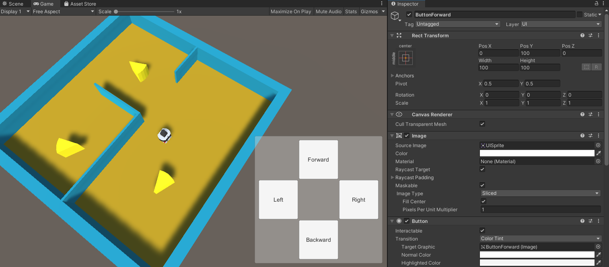
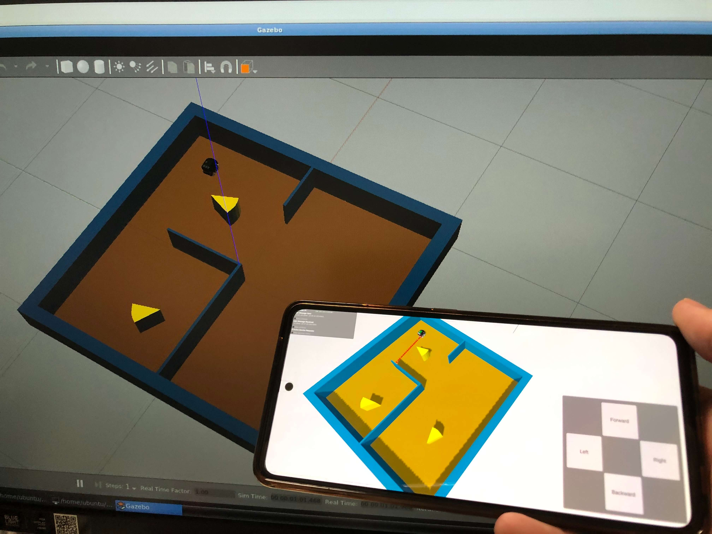
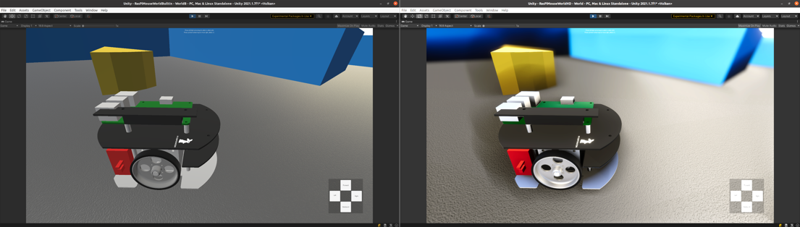
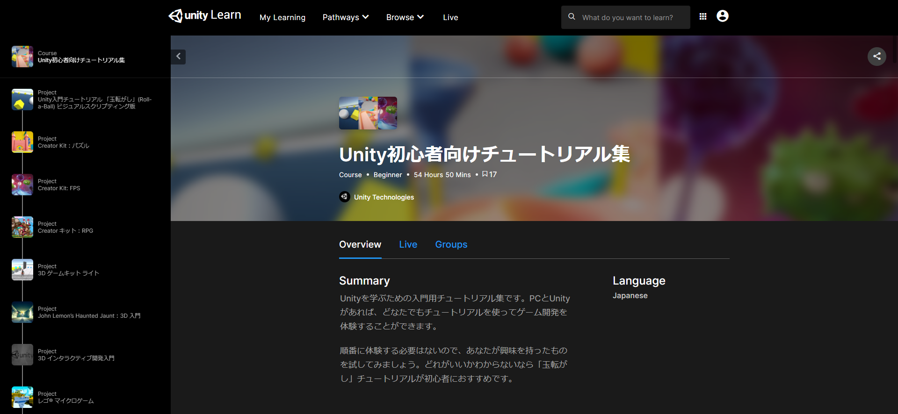

# Unityとロボットが連携することの利点
## UI作成が簡単
キーボードやマウス、ゲームコントローラ、タッチパネルなどを用いたUIを簡単に作成することができます。

本教材ではUnityに最初から用意されているボタンの部品を使用してRaspberry Pi Mouseを操作できるようにします。

## マルチプラットフォームサポート
様々なプラットフォーム上で動作するので使い方に応じて適切な端末を選ぶことができます。

例えばPCで動作するプロジェクトをスマートフォン向けにビルドすることが可能です。

現実のロボットを操作する際は、持ち運びしやすい端末から操作できるととても便利です。

またARやVR向けの対応も容易なため、より没入的で直感的なUIを作成することもできます。

対応プラットフォームについて詳しくは[こちら](https://unity.com/ja/features/multiplatform)をご覧ください。

## リアルタイムレンダリング
Unityはリアルタイムレンダリングを実現するための様々な仕組みを統合した開発環境です。

実機の動きをなめらかに表現できるだけでなく、低遅延のインタラクションを実現することが出来ます。

また、HDRP(High Definition Render Pipeline)を使うと現実により忠実な高品質な表現が行えたり、URP(Universal Render Pipeline)という仕組みを使うと複雑なレンダリングの処理を簡易な処理に置き換えることで負荷を低減させたりすることが出来ます。

参考までに、下記画像は左がUnity標準のBuilt-in、右がより高精細なHDRPを用いた画面です。

## 豊富な情報や素材
[公式チュートリアル](https://learn.unity.com/course/unity-tutorials-for-beginners-jp)や[マニュアル](https://docs.unity3d.com/ja/2020.3/Manual/UnityManual.html)、Unity公式の素材集である[Unity Asset Store](https://assetstore.unity.com/?locale=ja-JP)、個人のブログ記事などゲーム開発で培われた様々な技術や素材が蓄積されています。

Unityの使い方等でわからないことが出てきたら、こちらの[コミュニティ](https://unity.com/ja/community)のページや、[Unityユーザー助け合い所](https://www.facebook.com/groups/unityuserj)(日本語での質問が可能)にアクセスしてみて下さい。

さらなる学びや情報収集には、Unity Japan が運営する [Unity Learning Materials](https://learning.unity3d.jp/)もおすすめです。

---

* [目次](./intro2.md)
* < [INTRO0](./intro0.md)
* \> [INTRO2](./intro2.md)