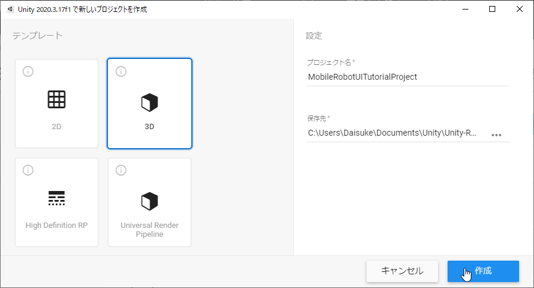
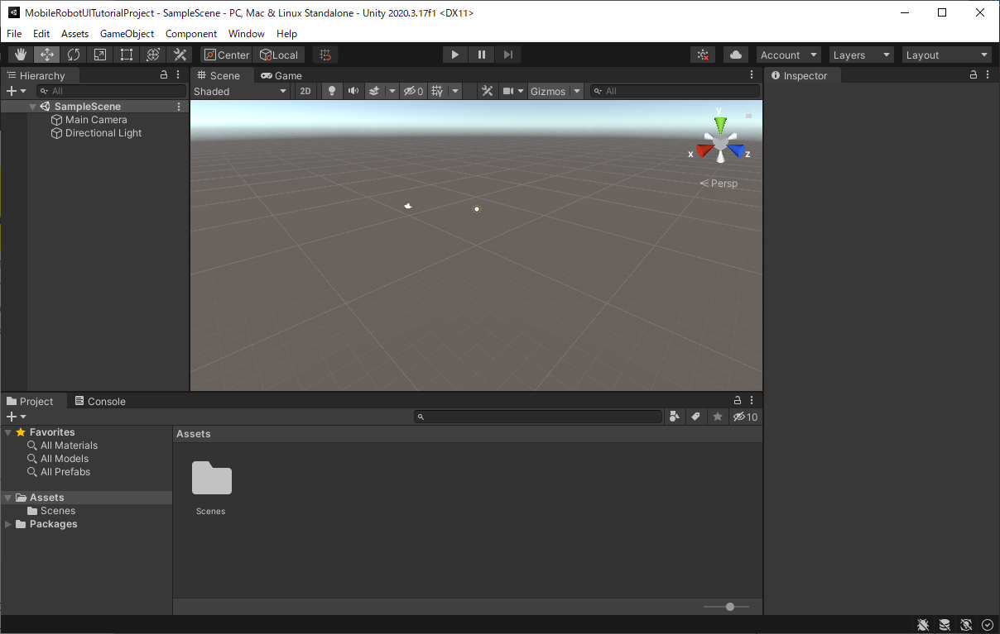
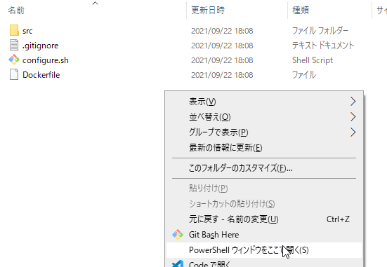
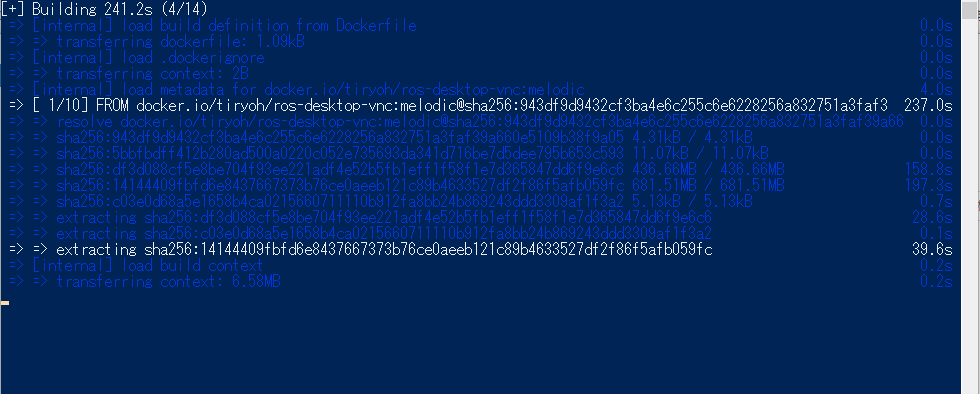
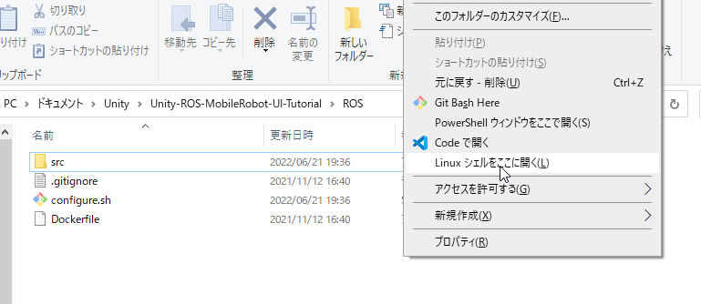
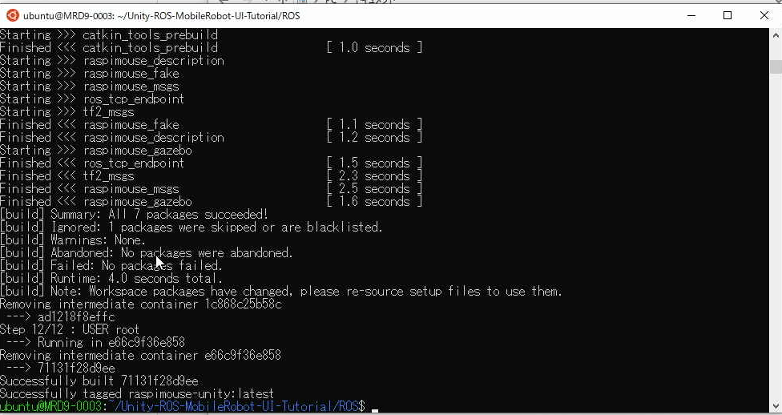

# UnityとROSのセットアップ

## 概要

Unityプロジェクトの作成とROSがインストールされたDockerイメージの構築について紹介します。

## 動作確認済環境

* Windows 10 Home バージョン 21H2
* Unity 2021.3.4f1

## Unityプロジェクトの作成

今回はLTS版の使用を推奨します。過去のバージョンについては[Unity ダウンロード アーカイブ](https://unity3d.com/jp/get-unity/download/archive)から取得できます。

3Dテンプレートを指定してプロジェクトを作成します。ここではプロジェクト名を「MobileRobotUITutorialProject」など他のプロジェクトと区別できる名称をつけておきます。



何も表示されていないSceneが起動すればUnityプロジェクトの作成は完了です。



次はDockerイメージの構築に進みます。

## Dockerイメージの構築（Docker Desktopの場合）

`ROS`フォルダの中でPowerShellを起動します。
エクスプローラで`ROS`フォルダを開き、Shiftキーを押しながら右クリックして「PowerShell ウィンドウをここで開く」を選択します。



PowerShellで以下のコマンドを実行します。
PowerShellでは右クリックでクリップボードの内容（コピーしたコマンド）を貼り付けることができます。

```sh
docker build -t raspimouse-unity:latest .
```

構築中はログが出力されます。
初回は構築に時間がかかる場合があります。PCのスペックやネットワークに左右されますが5分程度かかる場合がありました。

この間、次の[STEP1](./step1.md)を進めておくこともできます。



以下のようなメッセージが出力されていればイメージ作成が正常に完了しています。

```
 => => naming to docker.io/library/raspimouse-unity:latest   0.0s
```

以上でROSがインストールされたDockerイメージの構築は完了です。

※期間をあけて再度本チュートリアルを試している場合にはキャッシュが残っており、古いROSパッケージが参照されることがあります。  
その場合は以下のコマンドで最新版のDockerイメージを構築することができます。

```sh
docker pull tiryoh/ros-desktop-vnc:melodic
docker build --no-cache -t raspimouse-unity:latest .
```

## Dockerイメージの構築（WSL 2のDockerの場合）

`ROS`フォルダの中でLinux シェルを起動します。
エクスプローラで`ROS`フォルダを開き、Shiftキーを押しながら右クリックして「Linux シェルをここで開く」を選択します。



Linux シェルで以下のコマンドを実行します。
Linux シェルでは右クリックでクリップボードの内容（コピーしたコマンド）を貼り付けることができます。

```sh
docker build -t raspimouse-unity:latest .
```

もし`Cannot connect to the Docker daemon`などのエラーが出た場合は、INTRO3で紹介したコマンドでDockerのサービスを起動してから`docker build`を実行します。

```
sudo systemctl start docker
```

構築中はログが出力されます。
初回は構築に時間がかかる場合があります。PCのスペックやネットワークに左右されますが5分程度かかる場合がありました。

この間、次の[STEP1](./step1.md)を進めておくこともできます。

以下のようなメッセージが出力されていればイメージ作成が正常に完了しています。

```
Successfully tagged raspimouse-unity:latest
```



以上でROSがインストールされたDockerイメージの構築は完了です。

※期間をあけて再度本チュートリアルを試している場合にはキャッシュが残っており、古いROSパッケージが参照されることがあります。  
その場合は以下のコマンドで最新版のDockerイメージを構築することができます。

```sh
docker pull tiryoh/ros-desktop-vnc:melodic
docker build --no-cache -t raspimouse-unity:latest .
```

## 本STEPのまとめ

Unityプロジェクトの作成方法とROSがインストールされたDockerイメージの構築について紹介しました。

次は[STEP1](./step1.md)に進み、今回作成したUnityプロジェクトにRaspberry Pi Mouseのハードウェアモデルデータを読み込みます。

---

* [目次](./intro2.md)
* < [INTRO3](./intro3.md)
* \> [STEP1](./step1.md)
