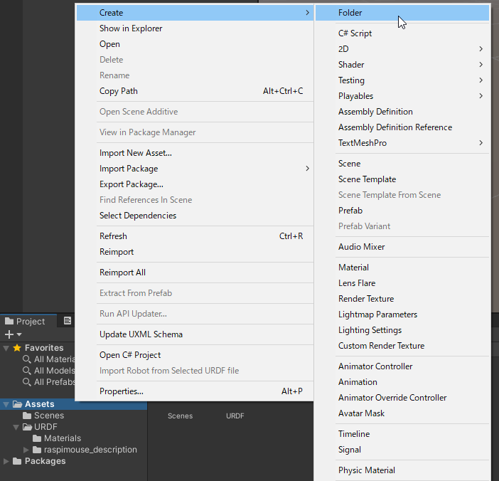
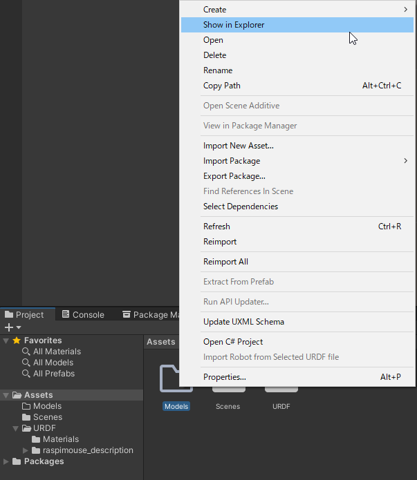
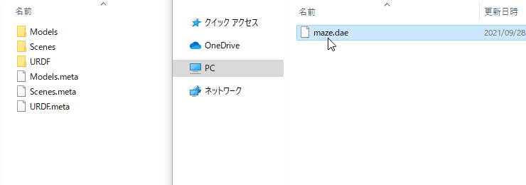
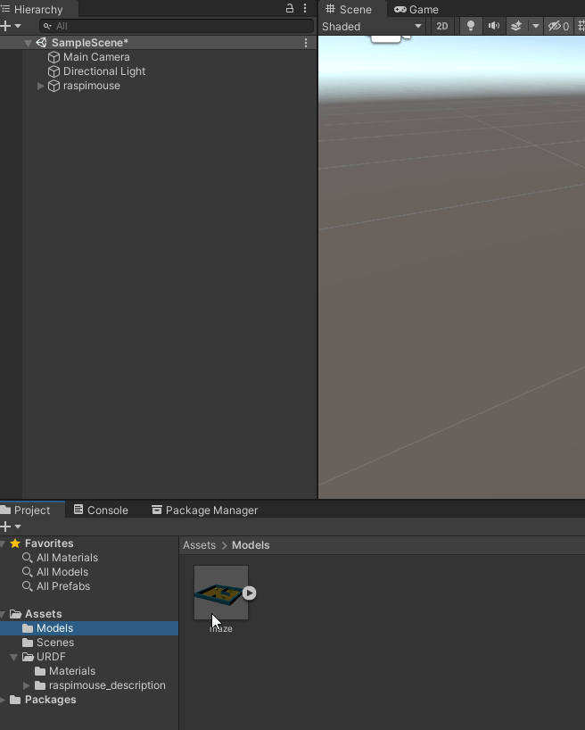
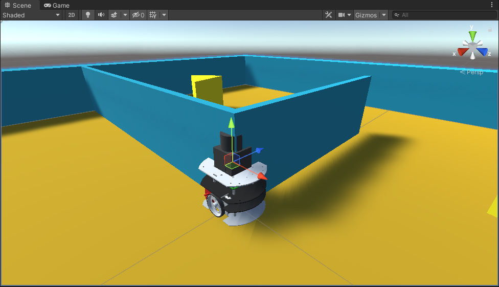
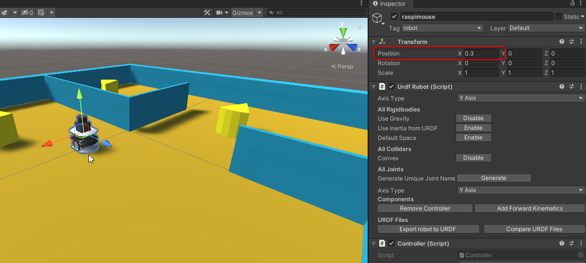
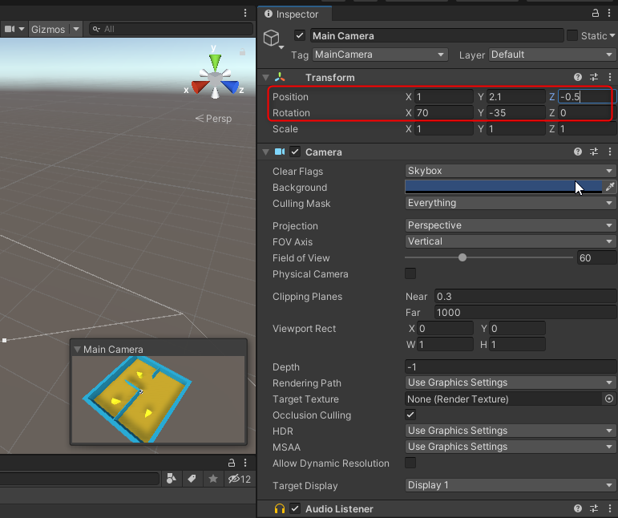

# ロボット周辺環境のハードウェアモデル（World）データの読み込み

## 概要

ロボット周辺環境のハードウェアモデル（World）データをUnityにインポートします。

今回使用するモデルはCOLLADA（`.dae`）形式として定義されているWorldデータです。

本ステップ実行後の状態のSceneファイルは[`MobileRobotUITutorialProject/Assets/Scenes/Step2.unity`](../MobileRobotUITutorialProject/Assets/Scenes/Step2.unity)から入手できます。

## 動作確認済環境

* Windows 10 Home バージョン 20H2
* Unity 2020.3.17f

## 手順

### 1. Worldデータを入手

Worldデータをダウンロードし、その中のCOLLADAファイルをプロジェクト内の`Assets/Models`フォルダへ配置します。
今回はWorldデータを予め本プロジェクトと一緒にダウンロードしているのでコピーして配置します。

まず、UnityのProjectパネルで、`Assets/Models`フォルダを作成します。

次に作成した`Assets/Models`フォルダをエクスプローラで開きます。

`ROS/src/raspimouse_sim/raspimouse_gazebo/models/cheeze_maze_a/meshes`フォルダ内の`maze.dae`を`Models`フォルダへコピーします。

ここまででWorldデータの準備は完了です。

### 2. WorldデータをUnityで読み込む

WorldデータをUnity上で読み込み、次のSTEP以降で使いやすいようにカメラのアングルを設定しておきます。

まず、`Assets/Models`内の`maze.dae`をHierarchyウィンドウに
ドラッグアンドドロップでGameObjectを配置します。

エラーなくインポートできればSceneビューに迷路が出現しているはずです。

ここでRaspberry Pi Mouseが迷路に埋もれないよう`raspimouse`オブジェクトをX軸方向に0.3ほどずらしておきます。

次にGameビューを調整するためにカメラのアングルを調整します。

`Main Camera`のビューを確認しながら`Main Camera`の`Position`と`Rotation`を調整します。以下が参考値です。

* Position
    * `X`, `Y`, `Z`: 1, 2.1, -0.5
* Rotation
    * `X`, `Y`, `Z`: 70, -35, 0

以上でWorldデータのUnity上での読み込みとカメラのアングル調整は完了です。

## 本STEPのまとめ

Worldデータを準備し、COLLADAファイルをUnityのプロジェクトにインポートする方法を紹介しました。
さらに可視化のためのモデルとカメラアングルの微調整方法を紹介しました。

※WorldデータがCOLLADAファイルでない場合は[STEP1](./step1.md)で紹介したURDF-Importerと[pysdf](https://github.com/andreasBihlmaier/pysdf)を併用するなどの工夫が必要になりますが、様々なパターンがありますのでここでは割愛します。

次は[STEP3](./step3.md)でロボット操作用ボタンを作成し、UnityからGazebo上のロボットへ速度指令を送信します。

---

* [目次](./intro2.md)
* < [STEP1](./step1.md)
* \> [STEP3](./step3.md)