# ロボット操作用ボタンの作成とUnityからGazebo上のロボットへ速度指令を送信

## 概要

ロボット操作用ボタンの作成からUnityからGazebo上のロボットへ速度指令を送信するまでの手順を紹介します。

本ステップ実行後の状態のSceneファイルは[`MobileRobotUITutorialProject/Assets/Scenes/Step3.unity`](../MobileRobotUITutorialProject/Assets/Scenes/Step3.unity)から入手できます。

## 動作確認済環境

* Windows 10 Home バージョン 21H2
* Unity 2021.3.4f1
* [Unity-Technologies/ROS-TCP-Connector](https://github.com/Unity-Technologies/ROS-TCP-Connector) v0.7.0
* Docker Desktop 4.9.1

## 手順

### 1. パッケージマネージャからROS-TCP-Connectorをインストール

パッケージマネージャからROS-TCP-Connectorをインストールします。パッケージマネージャはメニューバーの`Window -> Package Manager`から開けます。

左上の＋ボタンから`Add package from git URL`をクリックします。


ROS-TCP-ConnectorのGitリポジトリへのURLを最新のタグを指定して入力し、`Add`をクリックします。2022年6月現在最新のタグは`v0.7.0`です。
この場合のGitリポジトリへのURLは `https://github.com/Unity-Technologies/ROS-TCP-Connector.git?path=/com.unity.robotics.ros-tcp-connector#v0.7.0` となります。
※今後のバージョンアップによって使い方が変わる可能性があります。本チュートリアルでは「動作確認環境」に記載のバージョンでのみ動作確認をしています。

メニューバーに`Robotics`というメニューが追加されます。メニューバーから`Robotics` -> `ROS Settings`を開き、以下の設定となっていることを確認します。

* Connect on Startup: True
* Protocol: ROS1
* ROS IP Address: 127.0.0.1
* ROS Port: 10000
* Show HUD: True

### 2. ロボット操作用ボタンを作成

Hierarchyウィンドウを右クリックして`UI`->`Panel`を選択します。

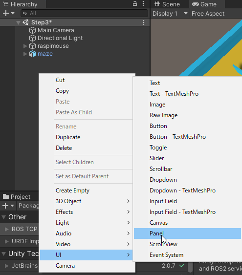

InspectorウィンドウでPanelの位置とサイズを調整します。
PanelはGameウィンドウから確認することができます。

`Rect Transform`コンポーネント左上にある二重の四角をクリックすると
Panel位置を調整するためのAnchor Presetsが開くので右下寄せになるright-bottomを選択します。

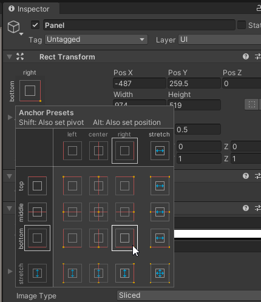

Pos X, Pos Y, Pos Z, Width, Heightはそれぞれ-170, 170, 0, 320, 320にします。

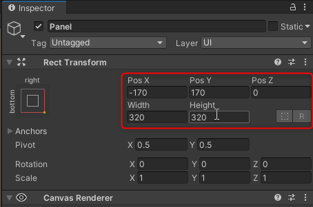

次にHierarchyウィンドウで`Canvas`->`Panel`を右クリックして`UI`->`Button`を選択し、`ButtonForward`と名前をつけます。

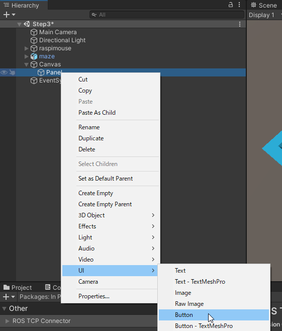
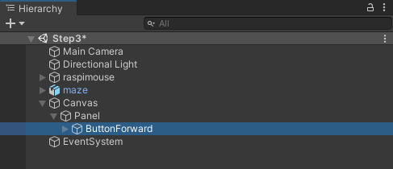

InspectorウィンドウでButtonの位置とサイズを調整します。

Pos X, Pos Y, Pos Z, Width, Heightはそれぞれ0, 100, 0, 100, 100にします。

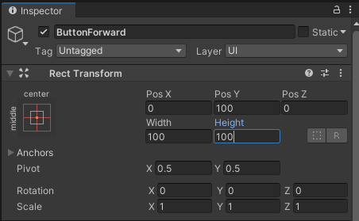

次にHierarchyウィンドウから`ButtonForward`オブジェクトの子の`Text`オブジェクトを選択し、Buttonのラベルを「Forward」に修正します。

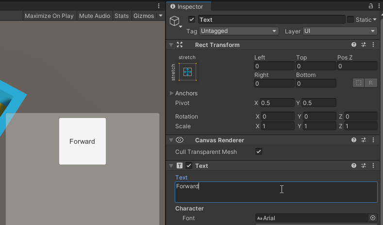

同様にしてBackward, Left, Rightについても作成します。

| Button | Pos X | Pos Y | Pos Z | Width | Height | Text |
| :----- | :---- | :---- | :---- | :---- | :----- | :--- |
| ButtonForward | 0 | 100 | 0 | 100 | 100 | Foraward |
| ButtonBackward | 0 | -100 | 0 | 100 | 100 | Backward |
| ButtonLeft | -100 | 0 | 0 | 100 | 100 | Left |
| ButtonRight | 100 | 0 | 0 | 100 | 100 | Right |

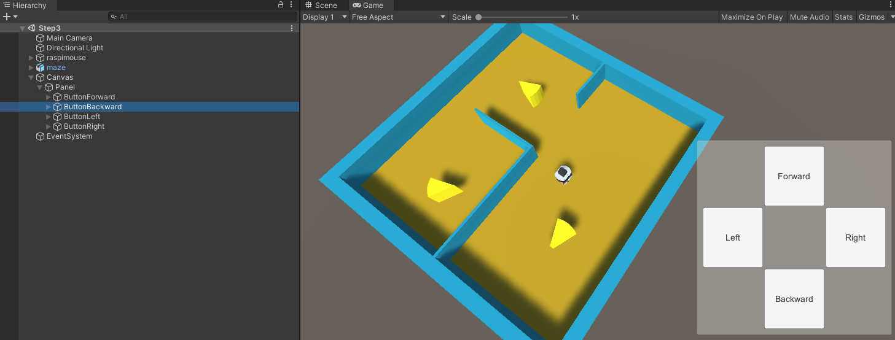

次にHierarchyウィンドウを右クリックして`Create Empty`を選択し、`Publisher`としてGameObjectを作成します。

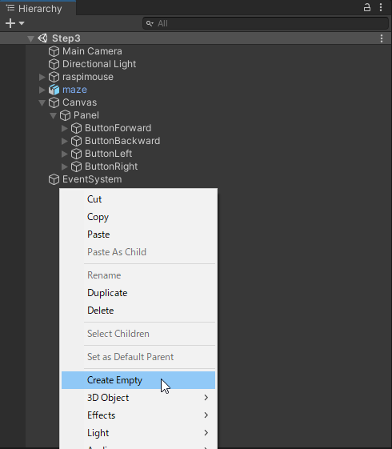
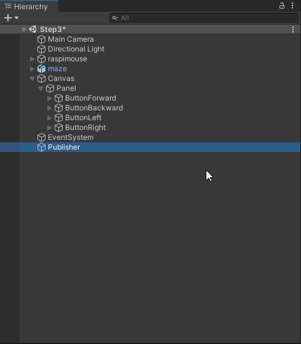

### 3. 操作用ボタンにイベントを登録

次に作成したボタンにイベントを登録します。

[`UnityScripts/Scripts`](../UnityScripts/Scripts)フォルダをUnityプロジェクトの`Assets`フォルダにコピー（`Assets/Scripts`として配置）します。

コピーした`Scripts`フォルダ内の`CmdVelPublisher.cs`を先程作成した`Publisher`オブジェクトにコンポーネントとして追加します。

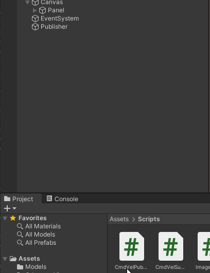

`Publisher`オブジェクトのInspectorウィンドウを確認すると`Cmd Vel Publisher`スクリプトが追加されていることを確認できます。ここの`Linear Vel`が進行方向の基準となる速度、`Angular Vel`が旋回方向の基準となる角速度となっています。今回はそれぞれを`0.5`と`1.5`に設定します。速度の単位はm/s、角速度の単位はrad/sです。

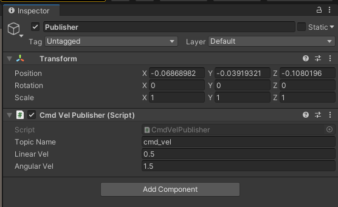

`ButtonForward`オブジェクトのInspectorウィンドウの`Add Component`ボタンから`Event Trigger`コンポーネントを追加します。

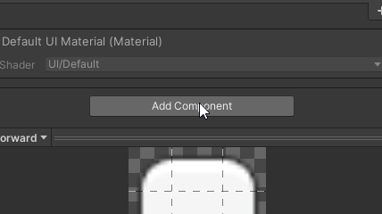

`Add New Event Type`から`Pointer Down`イベントを追加します。

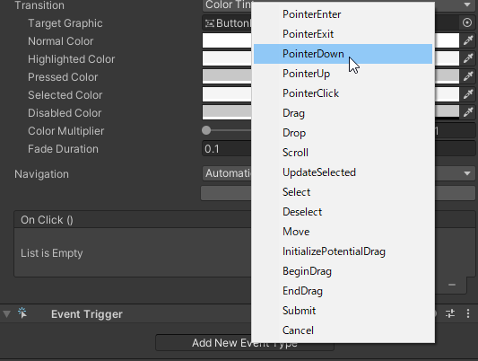

`Pointer Down`イベントのリストを2つに増やし、それぞれに`Publisher`オブジェクトを指定します。

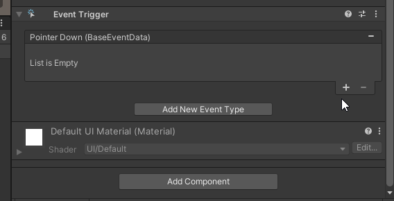

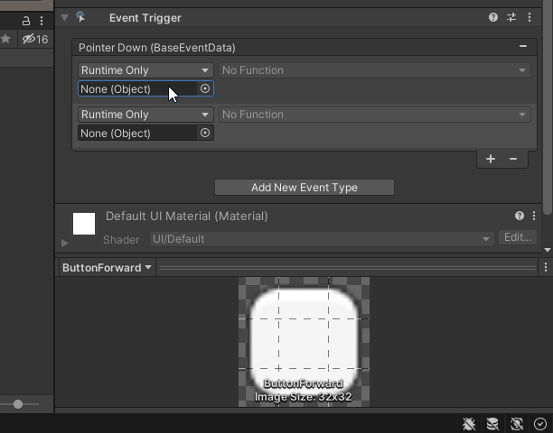

追加した`Pointer Down`イベントに上から順に`CmdVelPublisher.SetForwardVel`ファンクションと`CmdVelPublisher.Publish`ファンクションを指定します。
このとき`CmdVelPublisher.SetForwardVel`ファンクションの引数は`1`を指定します。
この引数が`Publisher`オブジェクトのInspectorウィンドウから確認できる基準速度、基準角速度にかける倍率です。
今回は進行方向の基準速度が`0.5`、倍率が`1.0`なので0.5m/sの移動指令を送信することになります。


同様にして`Pointer Up`イベントに`CmdVelPublisher.SetStopVel`と`CmdVelPublisher.Publish`ファンクションを指定します。
このイベントを登録することでボタンを離したら移動指令を止める（押している間だけ移動指令を出す）ことができるようになります。

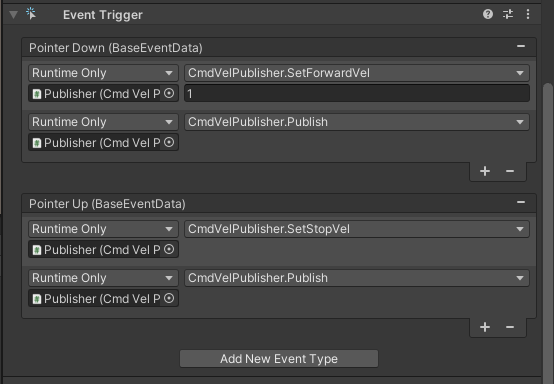

同様にして各ボタンに移動指令を送信のイベントを登録します。

繰り返しでイベントを登録する際にはコンポーネントを使いまわしすると楽です。

`ButtonForward`オブジェクトの`Event Trigger`コンポーネントのオプションから`Copy Component`を選びます。

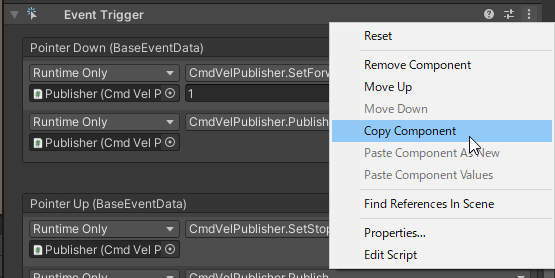

`ButtonBackward`オブジェクトに`Event Trigger`コンポーネントを追加し、オプションから`Paste Component Values`を選びます。

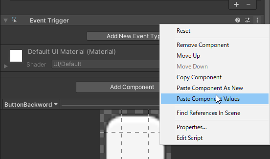

`Pointer Down`イベントの1つ目のファンクションを`CmdVelPublisher.SetBackwardVel`ファンクションに変更します。

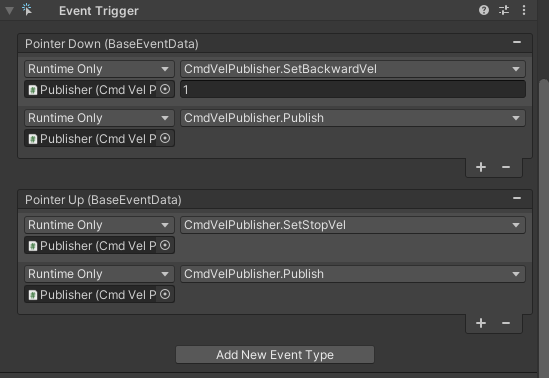

以上で2つ目のボタンへのイベント登録は完了です。

同様にして`ButtonLeft`オブジェクトと`ButtonRight`オブジェクトに`Event Trigger`コンポーネントを追加して設定をコピーし、
それぞれ`CmdVelPublisher.SetLeftTurnVel`と`CmdVelPublisher.SetRightTurnVel`を指定します。

以上で4つのボタンへのイベントの登録が完了です。
### 4. ROS環境を起動

PowerShell/Linux シェルを起動してDockerコンテナを起動します。

```
docker run --rm -it -p 10000:10000 -p 5005:5005 -p 6080:80 --shm-size=512m raspimouse-unity:latest
```

以下のメッセージが表示されていればコンテナが無事起動できています。

```
Listening on http://localhost:6079 (run.py:87)
```

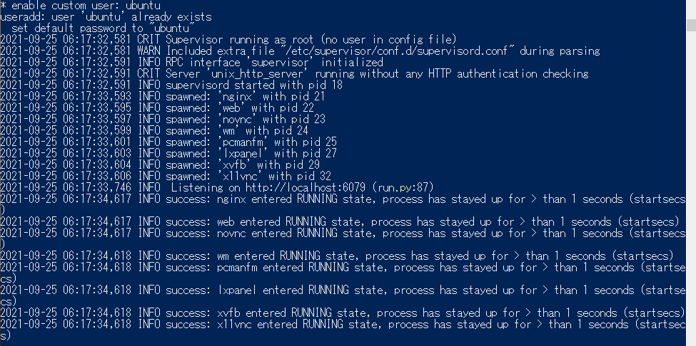

Webブラウザを開き[http://127.0.0.1:6080](http://127.0.0.1:6080)にアクセスします。


### 5. 再生モードでUnityプロジェクトを実行

Unityで再生ボタンを押し、再生モードでプロジェクトを実行します。

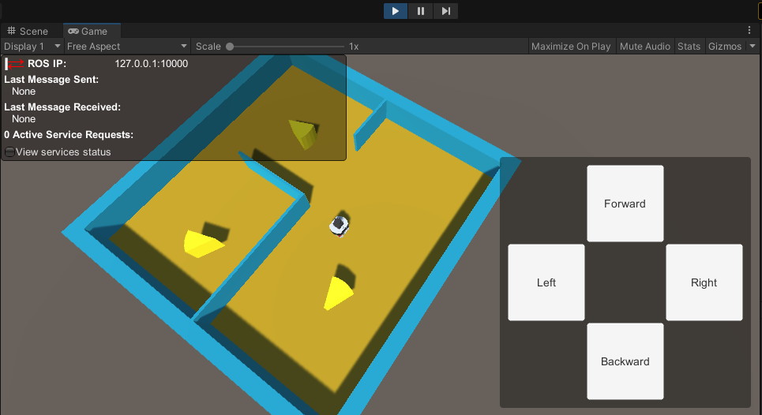

この状態で操作ボタンの動作確認をしてみます。ボタンを押すと左上の`Last Message Sent`の欄が更新されているのが確認できます。

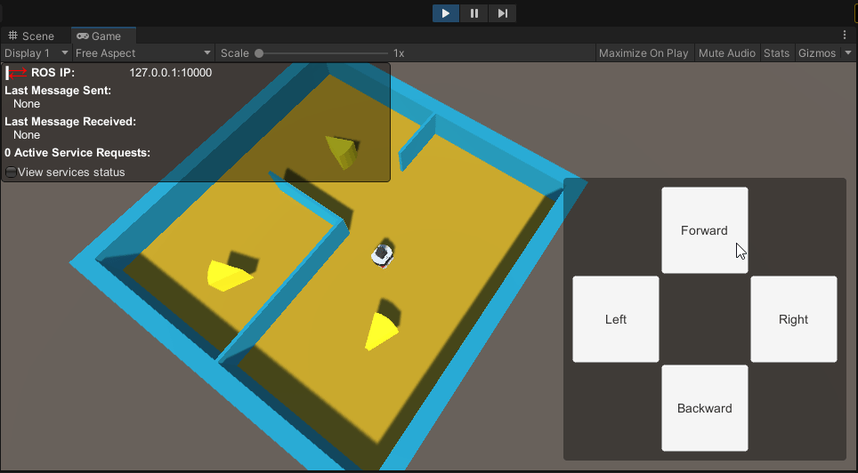

この間以下のようなメッセージがUnityのコンソールに出る場合もありますが、無視して問題ありません。  

```
Connection to 127.0.0.1:10000 failed - System.Net.Sockets.SocketException (0x80004005): 対象のコンピューターによって拒否されたため、接続できませんでした。
```

再生モード中の画面表示が小さい場合は、Gameビューの`Low Resolution Aspect Ratios`のチェックを外して下さい。

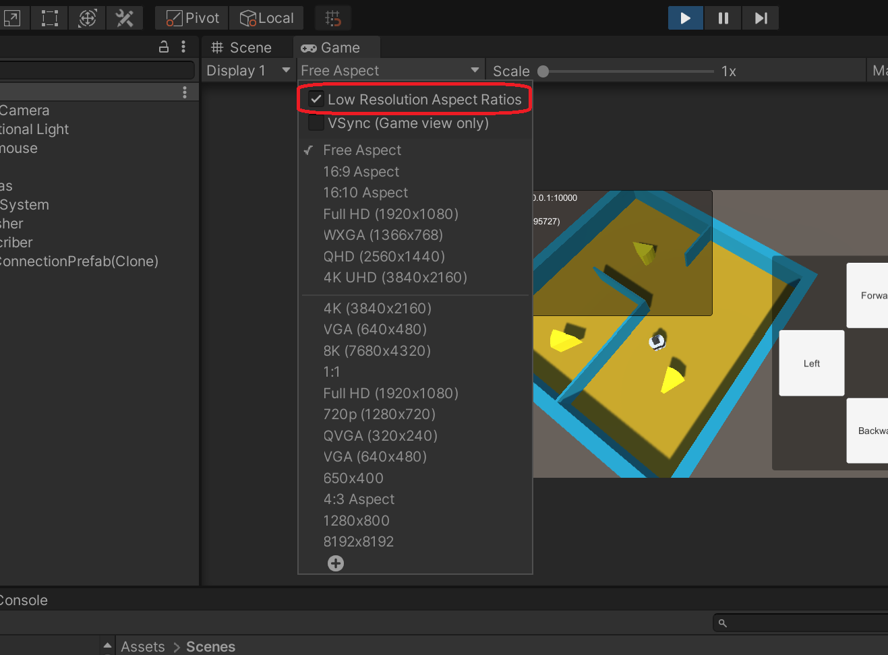


### 6. Gazeboシミュレータを起動

先程まで開いていたWebブラウザでLXTerminalを2つ起動します。

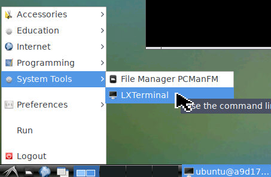


1枚目のLXTerminalで以下のコマンドを実行します。

```
roslaunch raspimouse_gazebo raspimouse_with_cheeze_maze.launch
```

ブラウザ上の環境にコピー&ペーストする際は
画面右側の三角のアイコンをクリックし、
クリップボードアイコンを選択して表示されるテキストボックスに入力することでペーストできるようになります。

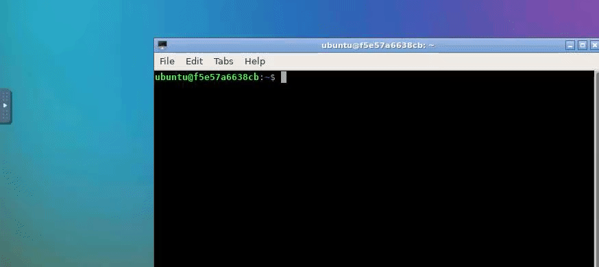

無事実行できると以下のようにシミュレータが起動します。


2枚目のLXTerminalで以下のコマンドを実行します。

```
roslaunch ros_tcp_endpoint endpoint.launch
```


### 8. 操作ボタンから移動指令送信

再生モードのUnityでボタンを操作すると移動指令が送信され、Gazebo上のロボットが移動することを確認できます。

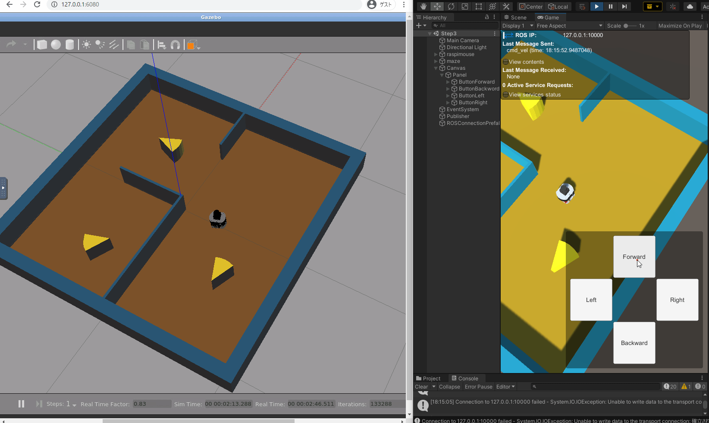


このとき、Unity上のロボットは動きません。Unity上のロボットもGazebo上のロボットにあわせて動かせるようにする方法は次の[STEP4](./step4.md)にて紹介します。

## 本STEPのまとめ

ロボット操作用ボタンを作成し、UnityからGazebo上のロボットへ速度指令を送信できるようにする方法を紹介しました。さらに実際にGazebo上のロボットを動かすまでを紹介しました。

次は[STEP4](./step4.md)でGazebo上のロボットの位置姿勢を可視化（Unity上に反映）する方法を紹介します。

---

* [目次](./intro2.md)
* < [STEP2](./step2.md)
* \> [STEP4](./step4.md)