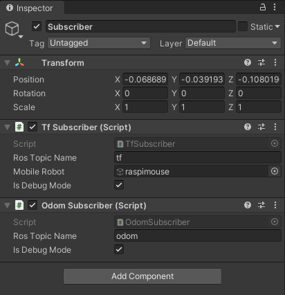
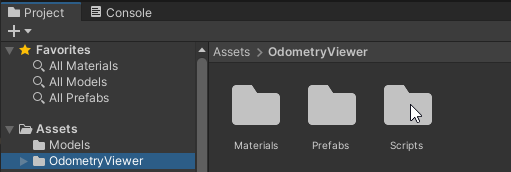
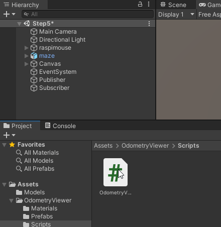
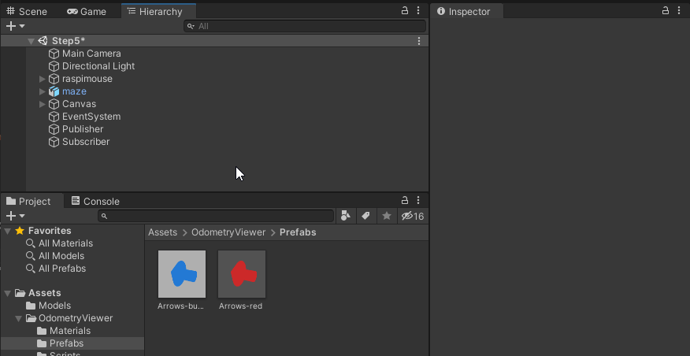
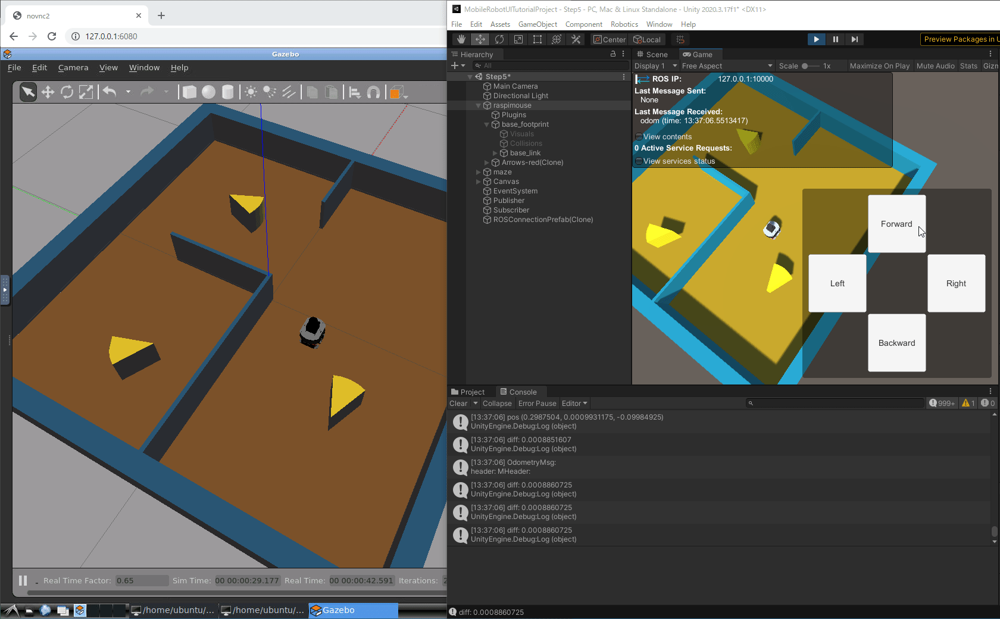
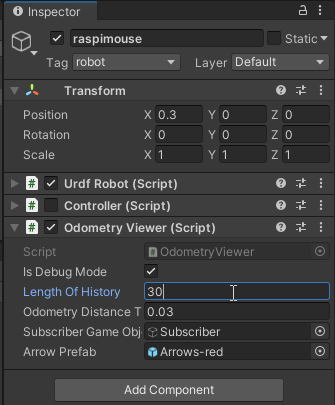
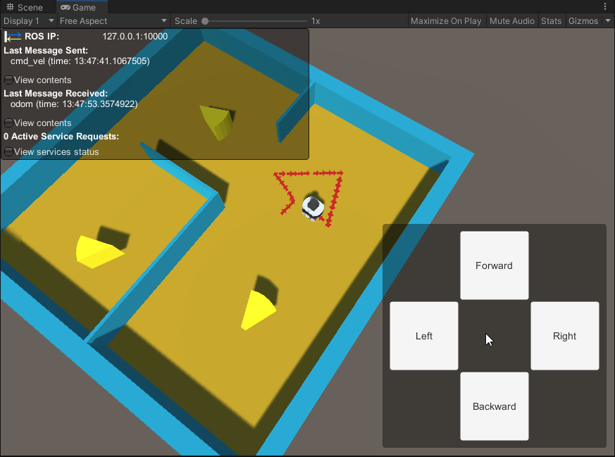

# オドメトリの可視化

## 概要

ロボットのオドメトリを可視化する方法を紹介します。
今回はオドメトリ受信用スクリプトとオドメトリ描画用スクリプトを組み合わせて可視化します。

本ステップ実行後の状態のSceneファイルは[`MobileRobotUITutorialProject/Assets/Scenes/Step5.unity`](../MobileRobotUITutorialProject/Assets/Scenes/Step5.unity)から入手できます。

## 動作確認済環境

* Windows 10 Home バージョン 20H2
* Unity 2020.3.17f
* [Unity-Technologies/ROS-TCP-Connector](https://github.com/Unity-Technologies/ROS-TCP-Connector) v0.5.0
* Docker Desktop 3.6.0

## 手順

### 1. オドメトリ受信用スクリプトをアタッチ

[STEP4](./step4.md)までと同様に`Assets/Scripts/OdomSubscriber.cs`を`Subscriber`オブジェクトにアタッチします。

ここまでで`Subscriber`に追加したコンポーネントは`Tf Subscriber`と`Odom Subscriber`の2つになります。

### 2. オドメトリ描画用スクリプトをアタッチ

まず、スクリプトを用意します。[`UnityScripts/OdometryViewer`](../UnityScripts/OdometryViewer)フォルダをUnityプロジェクトの`Assets`フォルダにコピー（`Assets/OdometyViewer`として配置）します。

次に用意したスクリプトをアタッチしていきます。
`Assets/OdometyViewer/Scripts/OdometryViewer.cs`を`raspimouse`オブジェクトにアタッチします。

`raspimouse`オブジェクトを選択してInspectorウィンドウを開き、`Odometry Viewer`コンポーネントの`Subscriber Game Object`に`Subsciber`オブジェクトを、`Arrow Prefab`に`Assets/OdometryViewer/Prefabs/Arrows-red.prefab`を指定します。

以上で可視化の準備ができました。

### 3. Unityプロジェクトの実行

[STEP3](./step3.md)と[STEP4](./step4.md)と同様に、

1. 再生モードでUnityプロジェクトを実行
2. Gazeboシミュレータを起動
3. 操作ボタンから移動指令送信

の手順でロボットを動かしてみます。

[STEP4](./step4.md)ではGazebo上の移動ロボットに合わせてUnityのロボットも動かすことができましたが、
今回はそれに加えてオドメトリを可視化することができました。

`Odometry Viewer`コンポーネントの`Length Of History`のパラメータを変えることで描画するオドメトリの履歴数を変更できます。

## 本STEPのまとめ

オドメトリ受信用スクリプトとオドメトリ描画用スクリプトを組み合わせて可視化する方法を紹介しました。
さらにパラメータを変更して描画する履歴の数を変更する方法も紹介しました。

次は[STEP6](./step6.md)でLiDARデータの可視化方法を紹介します。

---

* [目次](./intro2.md)
* < [STEP4](./step4.md)
* \> [STEP6](./step6.md)