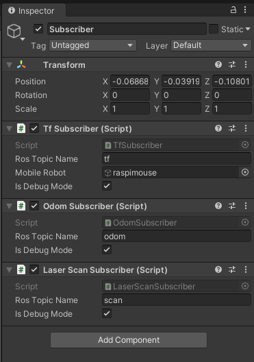
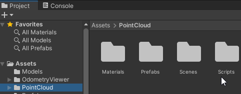
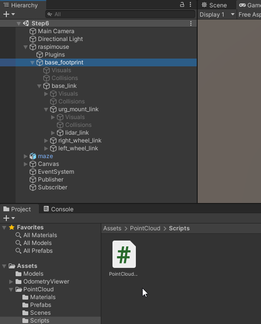
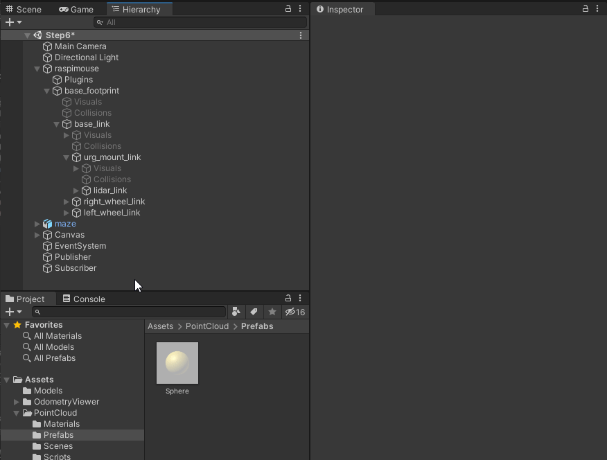
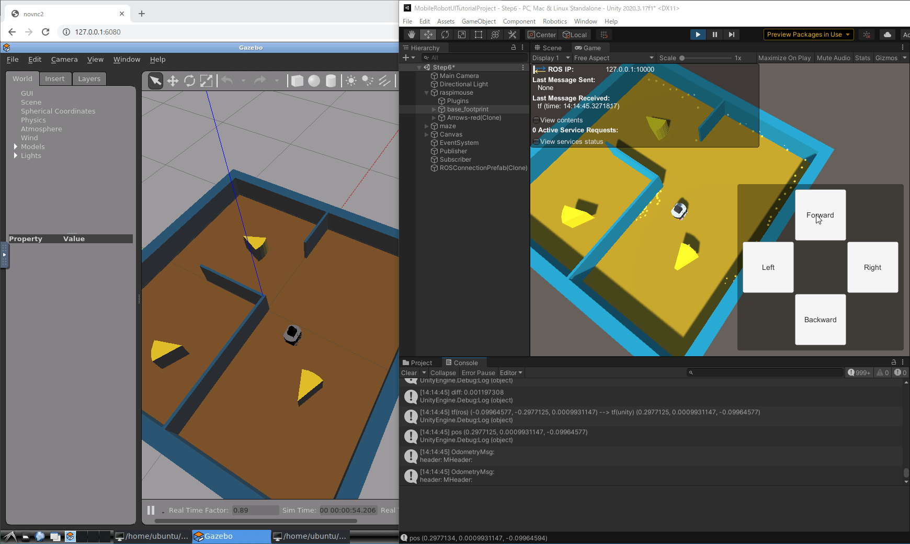

# LiDARデータの可視化

## 概要

ロボットのに搭載されているLiDARデータの可視化を紹介します。
今回もオドメトリ可視化の際と同様にLiDARデータ受信用スクリプトとLiDARデータ描画用スクリプトを組み合わせて可視化します。

本ステップ実行後の状態のSceneファイルは[`MobileRobotUITutorialProject/Assets/Scenes/Step6.unity`](../MobileRobotUITutorialProject/Assets/Scenes/Step6.unity)から入手できます。

## 動作確認済環境

* Windows 10 Home バージョン 20H2
* Unity 2020.3.17f
* [Unity-Technologies/ROS-TCP-Connector](https://github.com/Unity-Technologies/ROS-TCP-Connector) v0.5.0
* Docker Desktop 3.6.0

## 手順

### 1. LiDARデータ受信用スクリプトをアタッチ

[STEP5](./step5.md)までと同様に`Assets/Scripts/LaserScanSubscriber.cs`を`Subscriber`オブジェクトにアタッチします。

ここまでで`Subscriber`に追加したコンポーネントは`Tf Subscriber`、`Odom Subscriber`、`Laser Scan Subscriber`の3つになります。

### 2. LiDARデータ描画用スクリプトをアタッチ

まず、スクリプトを用意します。[`UnityScripts/PointCloud`](../UnityScripts/PointCloud)フォルダをUnityプロジェクトの`Assets`フォルダにコピー（`Assets/PointCloud`として配置）します。

次に用意したスクリプトをアタッチしていきます。
`Assets/PointCloud/Scripts/PointCloudLocator.cs`を`lidar_link`オブジェクト（`raspimouse/base_footprint/base_link/urg_mount_link/lidar_link`）にアタッチします。

`lidar_link`オブジェクトを選択してInspectorウィンドウを開き、`Point Cloud Locator`コンポーネントの`Subscriber Game Object`に`Subsciber`オブジェクトを、`Point Prefab`に`Assets/PointCloud/Prefabs/Sphere.prefab`を指定します。

以上で可視化の準備ができました。

### 3. Unityプロジェクトの実行

[STEP3](./step3.md)～[STEP5](./step5.md)と同様に、

1. 再生モードでUnityプロジェクトを実行
2. Gazeboシミュレータを起動
3. 操作ボタンから移動指令送信

の手順でロボットを動かしてみます。

[STEP5](./step5.md)で可視化したオドメトリに加えてLiDARデータを可視化することができました。

`Assets/PointCloud/Scripts/PointCloudLocator.cs`の`private static readonly int MaxPointCount = 100;`を書き換えることで
描画する点群の数を変えることができます。  

### 本STEPのまとめ

LiDARデータ受信用スクリプトとLiDARデータ描画用スクリプトを組み合わせて可視化する方法を紹介しました。
さらに描画する点群の数を変更する方法も紹介しました。

次は[STEP7](./step7.md)でカメラ画像の可視化方法を紹介します。

---

* [目次](./intro2.md)
* [STEP5](./step5.md)
* [STEP7](./step7.md)